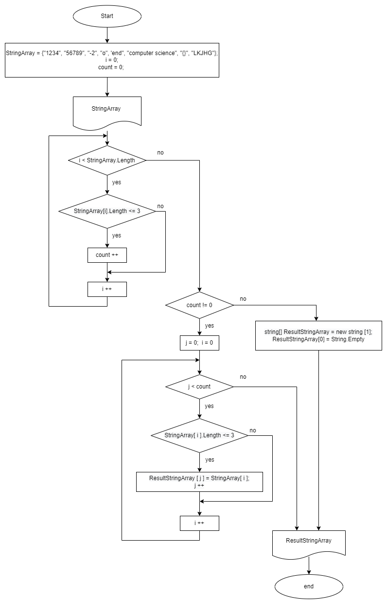
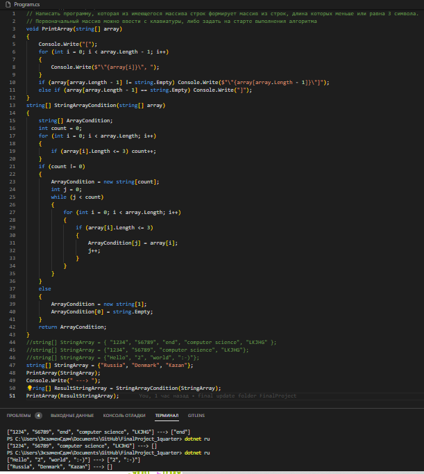

# Итоговый проект за 1 четверть

## Содержание проекта

* Постановка задачи

* Алгоритм решения (приложен файл Diagram-FinalProject.png)

* Описание решения

* Программа (и скриншот программы и результата её работы - файл ProgramFinalProject.png)

# Постановка задачи

Написать программу, которая из имеющегося массива строк формирует массив из строк, длина которых меньше или равна 3 символа.

Первоначальный массив можно ввести с клавиатуры, либо задать на старте выполнения алгоритма.

Примеры:

[“Hello”, “2”, “world”, “:-)”] → [“2”, “:-)”]

[“1234”, “1567”, “-2”, “computer science”] → [“-2”]

[“Russia”, “Denmark”, “Kazan”] → []

# Алгоритм решения

# Описание решения

1. Пусть первоначальный массив `StringArray` задан на старте выполнения алгоритма.

2. С помощью метода `PrintArray` выводим его на печать, для последующего сравнения с результирующим массивом.

3. Создаем с помощью метода `StringArrayCondition` новый, результирующий массив `ResultStringArray` длиной, равной числу элементов данного массива, длина которых < = 3.

4. С помощью метода `PrintArray` выводим результирующий массив на печать на одной строке с исходным (отображение "было ---> стало")

# Программа

(Разработанный алгоритм реализован на языке C#, программа написана в редакторе Visual Studio Code)

